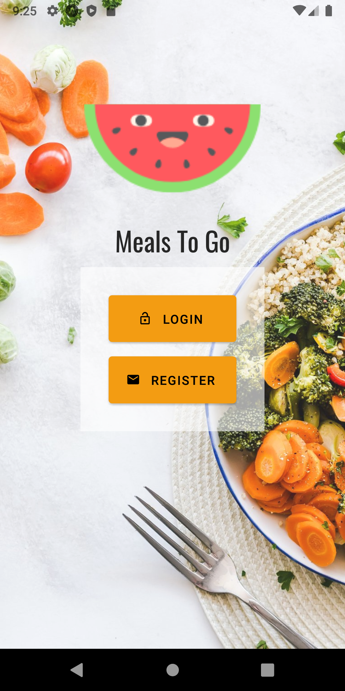

#  Meals To Go

## [Live Demo](https://youtu.be/vEAQKECr8ok)
## What is Meals To Go?
- A restaurant ordering application that help you book the restaurants.
- Meals To Go allows you to check and review restaurants in all over the world base on Google Maps Platform.
- The main purpose of this project is to have fun with React Native and its support ecosystem with its best practices.
- Therefore, this application `shouldn't be used for production` because it's created to be quite simple so as for everyone easy to understand the workflow.
You can consider using `Meals To Go` for produciton if only `you improve it`.

## Technology
- Frontend
  - React Native - A JavaScript technology for creating cross-platform mobile application.
  - React Native Paper - Design System follow Material Design guidelines.
  - Styled-component - custom component's styles.
- Backend
  - Firebase - Authentication, Function.
  - Google Maps Platform - Google APIs for geocoding and places.
  - Stripe - Online Payment Platform.

## Some preview images
  
  


## How to run?
In the project directory, you need:
### Setup Firebase Function
- Go to `function` folder and set `Firebase secret variables` (Stripe secret key & Google Maps Platform API key).
```
firebase functions:config:set stripe.key="..." google.key="..."
```
- Deploy functions to Firebase by running following command in `./functions` directory.
```
yarn deploy
```
- Finally, create a `./src/config/.env.js` file with content exactly like `./src/config/.env.example` file content.
- Then fill in all your [Firebase](https://firebase.google.com/) project config.


### Bootstrap application
```
yarn start
```

- Runs the app in the development mode.
- Open Expo app on IOS, Android emulator or real IOS, Android device.
- Make sure your laptop/pc is connecting to the same wifi with your devices.
- Then you will see your application appears in `Recently in development`.
- Access to it and enjoy the app.

# License & copyright

© Kirin Tran, FPT University TP.HCM
Licensed under the [MIT LICENSE](LICENSE).